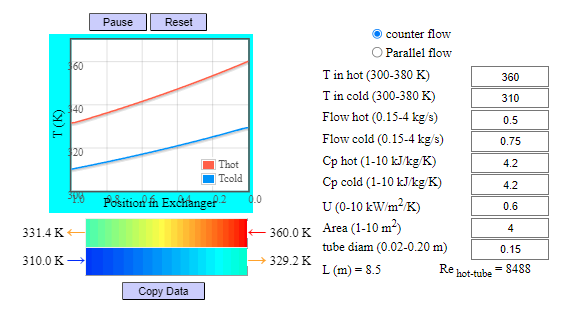
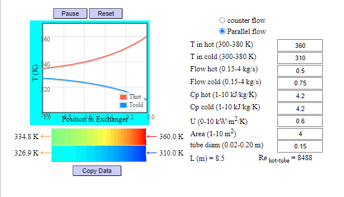

## Procedure

1. Click on the Experiment tab SIMULATON will open the workspace
                              
2. The simulation window open with the default values, you can change those values to get your desired results.

3. You can choose the flow type  
Counter Flow:  
 
Parallel Flow:  
  

4. Click React button to run the simulation.
                            
5. You can save by copy the output data. 
6. Reset simulation if required , after any value change it't set default values.             
                            
         
