## Theory

                            
One would be surprised to know that a lot of important processes, some very common ones, which we encounter in our everyday life, have a lot to do with heat transfer from one medium to another. The refrigerators and the air conditioners at our homes function on this very principle of heat transfer. Looking at nature, the evaporation of water from oceans is also an example of heat transfer.
When we look at transfer of heat from one or more media to another medium or media, the media giving the heat undergoes cooling and vice versa. Hence, the name 'heat exchangers'. Our lungs also act as heat exchangers and are quite efficient at that primarily due to the large surface to volume ratio. The radiators in cars also exchange heat with water releasing heat into the air passing through the radiator and in turn, cooling the engine. Heat exchangers are widely employed in industries for large scale processes. Condensers and boilers in steam plants are one of the examples. Heat exchangers have undergone numerous modifications over the ages and have become quite efficient compared to their predecessors. They have new designs, new materials and have been customized to meet specific needs. We will have a look at some of the most common types of them.

Types Of Heat Exchangers

Heat exchangers can be classified on various parameters- design and construction, flow arrangement, transfer process and number and state of fluids

Flow Arrangement:

<b>Co-current (Parallel) flow</b>- As the name suggests, the flow of the hot and the cold fluid is taking place in the same direction in this case. As the graph shows, the temperature difference between the hot and the cold fluid keeps on decreasing from one end to the other.

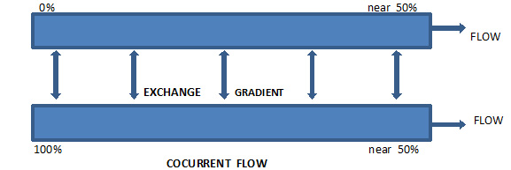   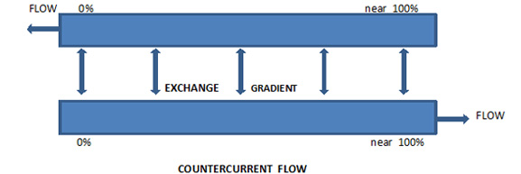
   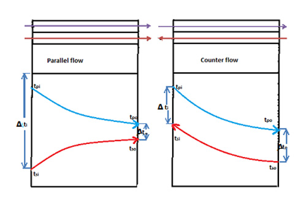

<b>Counter current flow-</b>In this setup, the hot fluid enters from one end of the exchanger and the cold from the opposite end. This results in nearly constant temperature difference between the hot and the cold fluid. This is a significant aspect and makes counter current exchangers preferable over co-current exchangers. We will discuss this point later when we talk about LMTD.

<b>Crossed flow-</b>The cold and the hot fluid flow axis is at an angle to each other and hence, the fluids cross each other in this arrangement. The most common type of crossed flow exchanges has the angle between axes as 90 degrees.

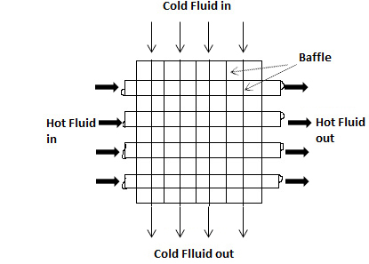
  
Transfer Process:

<b>Direct contact heat exchangers-</b>
This class of exchangers do not have a physical barrier between the hot and the cold fluids. Direct mixing of the fluids takes place which results in simultaneous heat and mass transfer. This setup is only employed when the mixing of fluids does not pose problems, or is actually required. A good example of this type of heat exchanger would be a cooling tower.

  
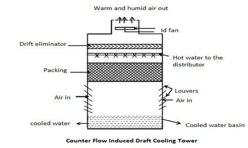

<b>Regenerative Exchangers- </b>
 Heat is alternately stored and removed from a heat surface in a regenerative exchanger. Called the matrix of the generator, the heat transfer surface is moved into and out of the fixed hot and cold fluid streams or, the cold and the hot currents is switched into and out of it as the case maybe. These two types are called rotary and fixed regenerative matrix exchangers respectively.

  

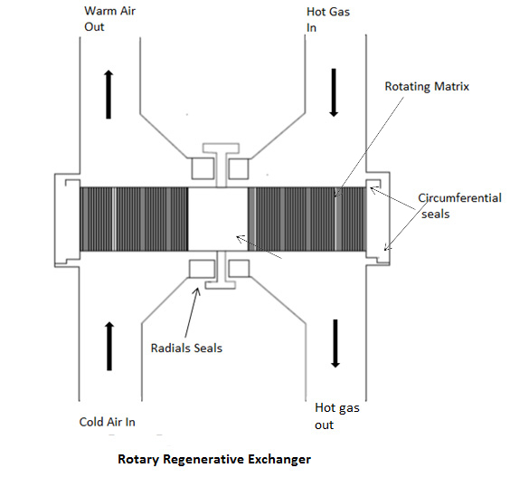
  

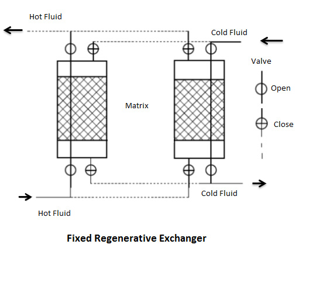

<b>Recuperators -</b> It is one of the most vital types of heat exchanger. There is a clear demarcating physical barrier between the hot and the cold fluids all along their flow. It is perfect for cases where one cannot afford to mix the fluids. Evaporators of an ice plant and automobile radiators are examples of this type of exchanger.

<b>Design And Construction:</b>

<b>Shell and heat tube exchangers -</b> It finds application in a variety of industries and is, without doubt, one of the most widely used exchangers. It has a series of tubes which is enclosed by a shell. One fluid flows inside the tubes while the other liquid flows over the outside walls of the tubes which, basically, is the shell. It's highly recommended for places where there's a need for high heat transfer coefficient as the number of tubes can be increased depending on the need. Due to its unique shape, it finds use in high pressure applications.

 

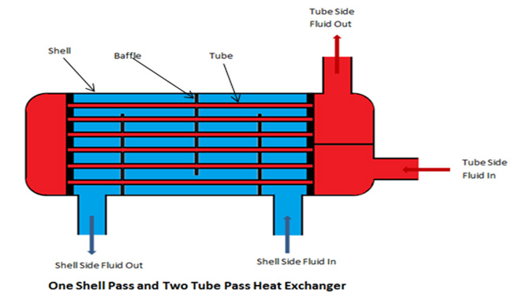

<b>Plate and frame heat exchanger -</b> This exchanger consists of a series of thin plates normal to the direction of flow of the fluids. The plates provide a large surface area for heat exchange and are, at some places, more convenient than the shell and heat tube exchanger primarily because of its unique shape.

 

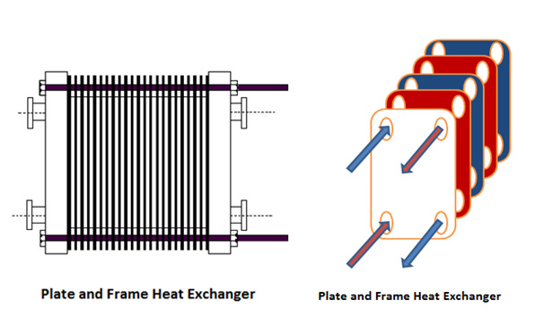

<b>Spiral heat exchangers -</b> This exchanger is formed by spiraling two parallel flat sheets to form a spiral consisting of two flow channels. The fluids flow through these channels and because of the shape, get a lot of surface area for heat transfer. The fluids generally flow in a counter current fashion in a spiral heat exchanger.

<b>Shell And Tube Heat Exchanger: Construction</b>

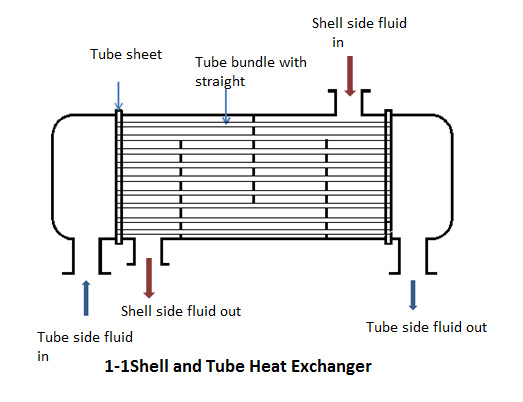

The above figure shows a 1,1 shell and tube heat exchanger. This mean that the exchanger has only one pass in the tube side. A pass denotes the number of turns of the tubes. The diagram below shows a 1,2 exchanger.

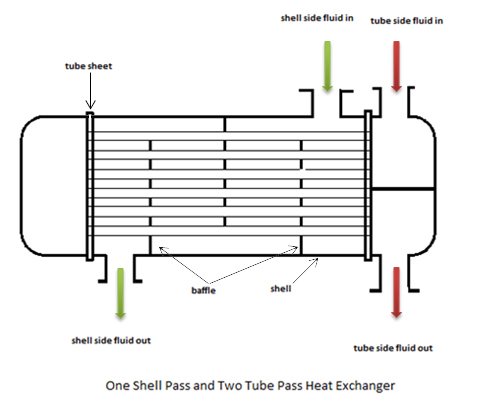

<b>Tubes -</b> The tubes provide the heat transfer area in a shell and tube heat exchanger.The tubes in a shell and tube heat exchanger are arranged in various arrangements. They are enclosed by a shell around them. They are available in various sizes and shapes according to B.W.G (Birmingham wire gauge) system.The selection of wall thickness of tube depends on maximum operating pressure and corrosion characteristics.

<b>Tube Pitch -</b> Various aspects have to be kept in mind while designing a shell and heat tube exchanger. The tubes cannot be made very close to each other as that would then leave very less amount of metal between the drilled tubes holes in tube sheets attached at the ends of the exchanger. And if the space between the tubes is very high, it would result in less surface area which in turn, would affect the efficiency of the exchanger. Hence, an optimum distance should be maintained. The shortest distance between centers of two adjacent tubes is called the tube pitch,should not be less than 1.25 times the tube diameter.

 

<b>Shell-</b>As shown in the figure, the shell is the outer casing of the heat exchanger. One fluid flows between the outer wall of the heat exchanger and inner wall of the shell while the other flows inside the tube.Shell has a circular cross section and selection of material of the shell depend upon the corrosiveness of the fluid and the working temperature and pressure.Carbon steel is a common material for the shell under moderate working conditions.

                            
<b>Baffles-</b>-These are panels responsible for obstructing and redirecting the flow of fluid in the shell side of an exchanger. They are situated normal to the walls of the shell and force the liquid to flow at right angles to the axis of the tubes. This increases turbulence resulting in greater heat transfer. Also, the baffles help in keeping the tubes from sagging and increase the strength of the tubes by preventing their vibration.

                                
<b>  Steady State</b>

                                
A situation in which all the state variables remain constant despite parallel processes trying to change them, is referred to as the steady state.

                                
<b>Time Constant</b>

When we talk about time constant, it's essential to take into account the context in which we are talking about it. In our case, time constant can be defined as 63% of the time that will be taken for a body to reach steady state.

                                
<b>Mathematical Modeling Of A Heat Exchanger</b>

                                
 For a proper analysis of the heat exchanger, let us first define a few symbols.

                                

				    <ul>
					<li>U-Overall heat transfer coefficient</li>
					<li>A-Total surface area of heat transfer</li>
					<li>$$T_{tube \ inlet}-Inlet \ temperature \ of \ the \ tube$$</li>
					<li>$$T_{tube \ outlet}-Outlet \ temperature \ of \ the \ tube$$</li>
					<li>$$T_{shell \ inlet}- Inlet \ temperature \ of \ the \ shell$$</li>
					<li>$$T_{shell \ outlet}- Outlet \ temperature \ of \ the \ shell$$</li>
					<li>F-Mass flow rate of hot fluid</li>
					<li>H-Mass flow rate of cold fluid</li>
					<li>$$c_{p-cold}- Specific \ heat \ of \ cold \ fluid \ at \ fixed \ pressure$$</li>
					<li>$$c_{p-hot}- Specific \ heat \ of \ hot \ fluid \ at \ fixed \ pressure$$</li>
					<li>$$T_{hot}- Temperature \ of \ hot \ fluid$$</li>
					<li>$$T_{cold}-Temperature \ of \ cold \ fluid$$</li>
					<li>ΔT- Temperature difference across the heat exchanger</li>
				    </ul>
				

If we neglect heat losses to the surroundings and assume the hotter fluid to flow in the tube,

$$Heat \ lost \ by \ the \ hot \ fluid=Fc_{(p-hot)} (T_{(tube \ inlet)}-T_{(tube \ outlet)})$$
  

$$Heat \ gained \ by \ the \ cold \ fluid= Hc_{(p-cold)} (T_{(shell \ inlet)}-T_{(shell \ outlet)})$$
 

Total heat transfer in the exchanger=UAΔΩ

where ΔΩ=logarithmic mean temperature difference (LMTD)

<b>Logarithmic mean temperature difference (LMTD)</b> can be defined as that temperature difference which, if constant, would give the same rate of heat transfer as actually occurs under variable conditions of temperature difference.

LMTD for a shell and heat tube exchanger, when calculated, comes out to be `((T_2-T_1)) / ln(T_2/T_1 )`

where,

T2-Temperature difference between shell and tube temperatures at one end

T1-Temperature difference between shell and tube temperatures at the other end

Since the temperature difference between the tube and the shell in a counter current flow remains approximately constant throughout, its LMTD is greater than for that of co-current flow. This means that counter current flow will give greater heat transfer than co-current flow for the same surface area. As a result of this, counter current flow is generally preferred over co-current flow.
      
                                
                        

     
 
